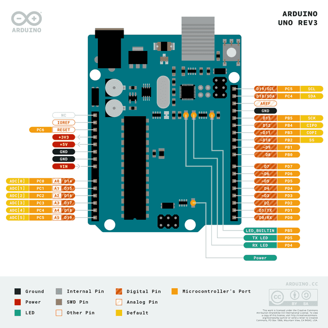
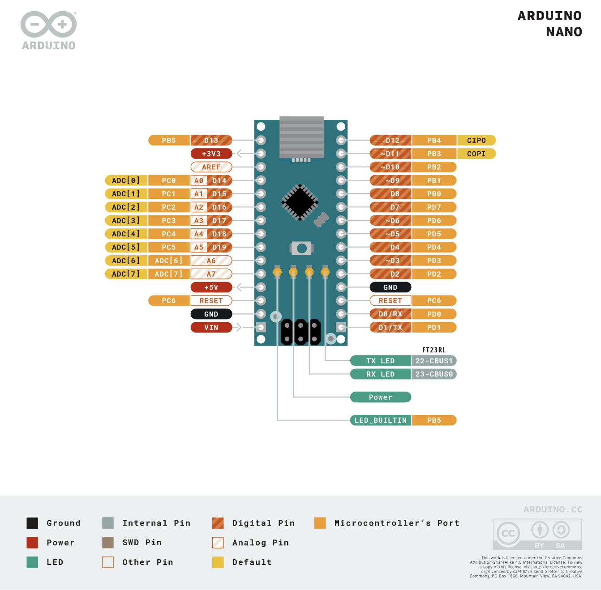
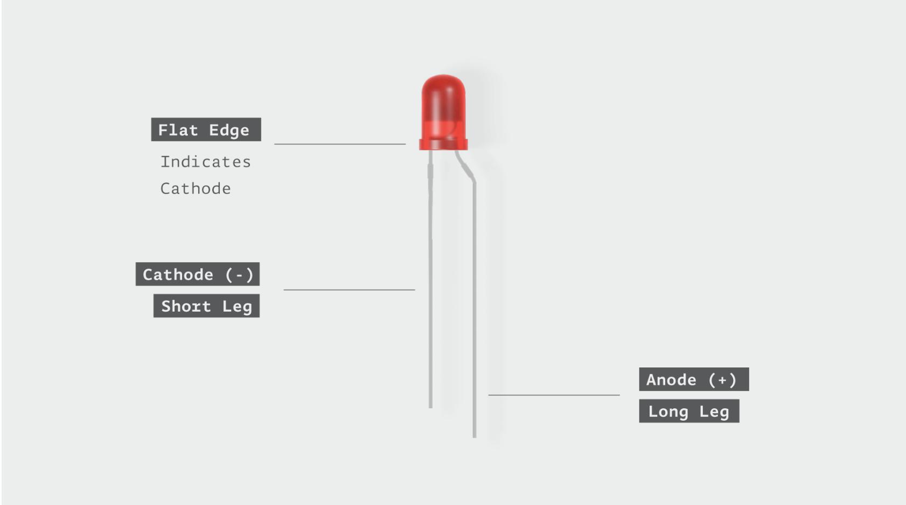
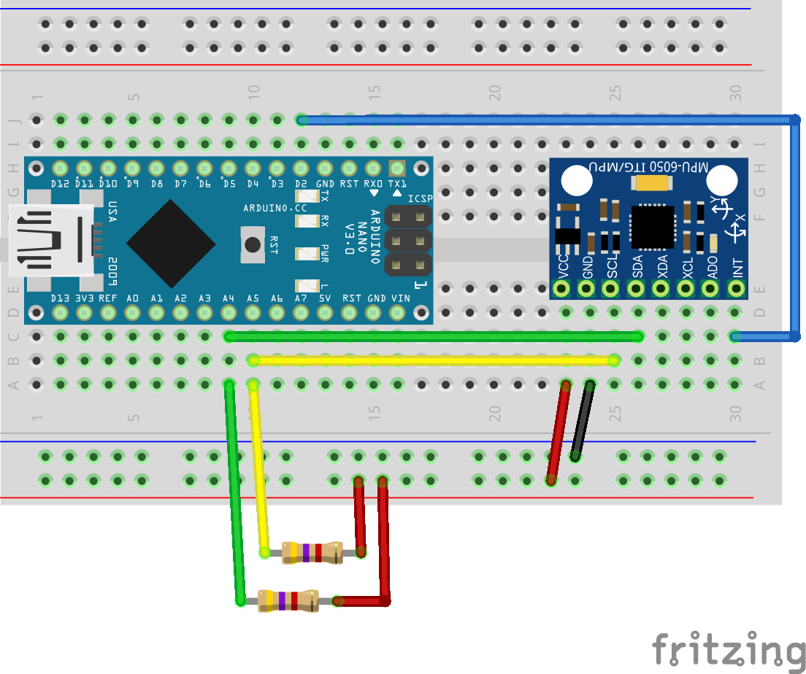
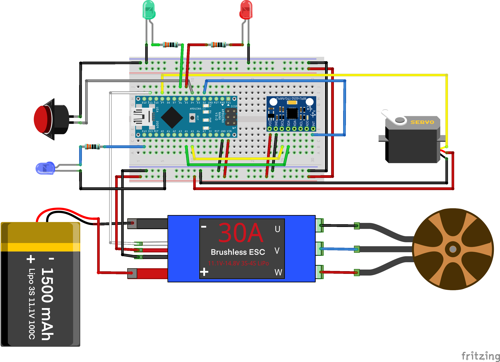
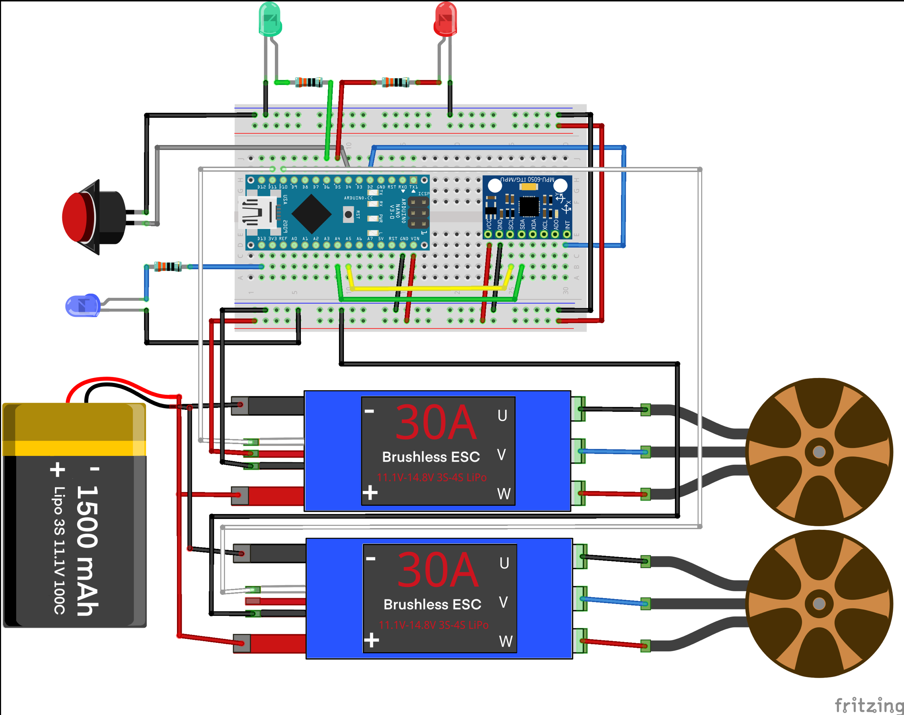
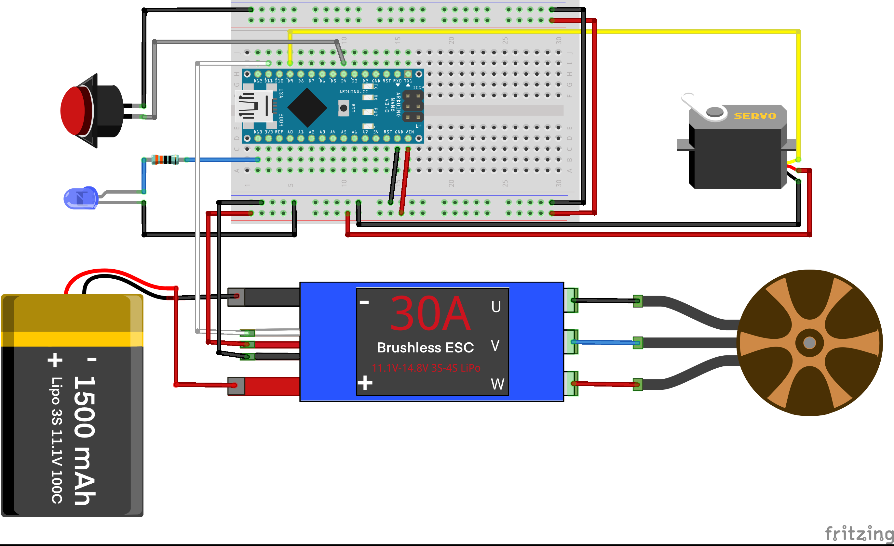
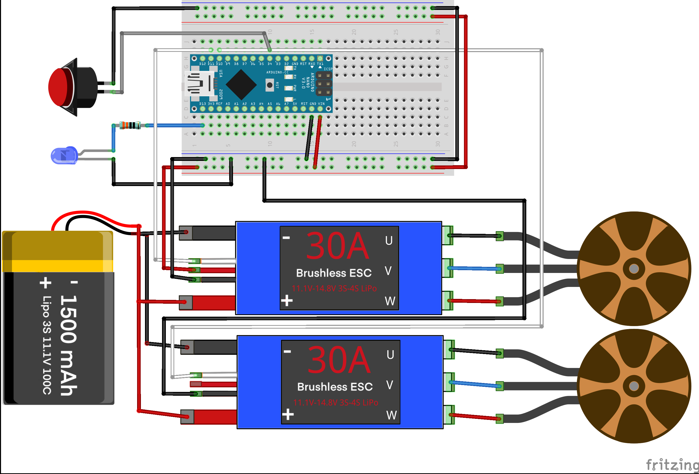
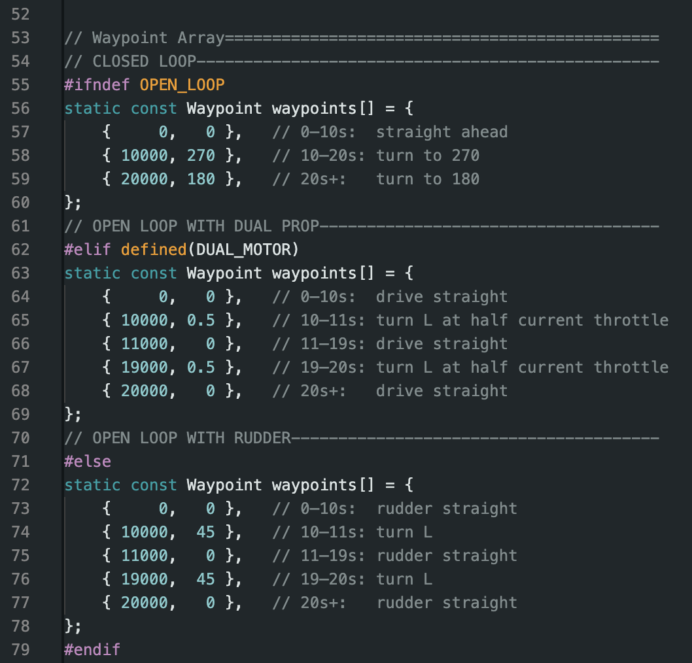

# GNOR

## GNOR Description
The Great Navel Orange Race (GNOR) is an annual competition held at UCF every year for the second intro to engineering course. The project involves students building a boat, submarine, or other watercraft that autonomously carries an orange around the reflection pond. 

This repository has been forked from the [TI Lab's GNOR_V4 Repo](https://github.com/UCFInnovationLab/GNOR_V4) to provide support for teams using Arduino microcontrollers. For teams using the TI Lab's MSP430 and MSP432 microcontrollers, or the ESP32, please see the aforementioned repository instead.

Teams using Arduino microcontrollers will be responsible for purchasing and connecting their hardware, such as using breadboards, quick connectors, or soldering to connect wires to the corresponding pins on the microcontroller. For teams using closed loop control, an MPU6050 IMU should be purchased to sense the watercraft's heading.

These components empower students to control servos, provide signals for high power relays and ESCs, measure angle change relative to starting angle, look at accelerometer data, and more.
This repository provides everything needed to get started using these components. This includes example code, pinouts, and more. If you have any questions or are having trouble getting started, **the TI Lab will NOT be responsible for helping with Arduino code or wiring setup.** You should reach out to the GTAs or your lab's TA to ask questions instead.

---

## Supported Boards

This project supports the following microcontroller boards:

| Arduino Uno | Arduino Nano |
|:-----------------:|:---------------:|
|  |  |
| Uno Rev3 (ATmega328) | Nano (ATmega328) |

---

## Arduino IDE 2.x Setup

This project requires only standard Arduino libraries. Please download Arduino IDE from [their site](https://www.arduino.cc/en/software/) by selecting the option corresponding to your computer's operating system and configuration.

---

## Software Download

Before opening the project in the Arduino IDE, you need to download the GNOR_V4 sketch and other supporting code from GitHub. There are two ways to do this:

### Option 1 — GitHub Desktop (Recommended)

GitHub Desktop is a free application that lets you clone and manage repositories with a graphical interface.

**Advantages:**
- If a bug fix or update is released, you can pull the latest changes with a single click — no need to re-download and re-extract a ZIP file.
- Your local copy stays linked to the repository, making it easy to stay up to date throughout the competition.

**Steps:**
1. Download and install [GitHub Desktop](https://desktop.github.com) if you have not already.
2. Open GitHub Desktop.
3. Click **File → Clone Repository**.
4. Select the **URL** tab.
5. Enter the repository URL: `https://github.com/Pabon02/GNOR_V4`
6. Choose a local folder to save the project.
7. Click **Clone**.
8. Once cloned, open the `GNOR_V4.ino` file in the Arduino IDE.

To update the project later, open GitHub Desktop and click **Fetch origin**, then **Pull** to download any new changes.

### Option 2 — Download ZIP

**Advantages:**
- No additional software required — works with just a web browser and file explorer.
- Quick and simple for a one-time download.

**Steps:**
1. Open `https://github.com/Pabon02/GNOR_V4` in your web browser.
2. Click the green **Code** button near the top right of the page.
3. Select **Download ZIP**.
4. Save the ZIP file to your computer.
5. Extract the ZIP file to a folder of your choice. Ensure the folder is named `GNOR_V4`.
6. Open the extracted `GNOR_V4/GNOR_V4.ino` file in the Arduino IDE.

Note: if updates or bug fixes are released, you will need to repeat this process and re-download the ZIP to get the latest version.

---

## Wiring Information

The wired connections to signal pins on the microcontroller are determined by the pin assignments in the code. As seen in the header file, various pins are given macro names and defined with a number: 

    #define SERVO1_PIN       9   // Rudder
    #define SERVO2_PIN       10  // Right motor (dual motor config)
    #define SERVO3_PIN       3   // Auxiliary servo
    #define ESC_PIN          11  // Single motor OR left motor (dual motor config)
    #define MOTOR_SWITCH     4   // Active low — use INPUT_PULLUP
    #define CALIBRATE_SWITCH 7   // Active low — use INPUT_PULLUP
    #define STARTUP_LED_PIN  13  // Onboard LED to indicate startup mode
    #define DRIFT_LED_PIN    5   // LED to indicate IMU drift
    #define HEADING_LED_PIN  6   // LED to indicate heading
    #define INT_PIN          2   // Reserved for potential MPU6050 INT wiring (not currently used)

Note that digital pins are represented with a plain number while analog pins are usually distinguished with 'A' prepended (e.g. A0, A1, A2, etc.).

#### Servo & ESC Wiring
When connecting a servo, the ground (black) and voltage (red) wires should connect to the common GND and V_in wires from the ESC. The signal (yellow) wire will connect to the digital pin outlined in the code block above (pin 9 for rudder servo).

When connecting one ESC, the ground (black) and voltage (red) wires will serve as your common GND and V_in. This means these wires will split power to all other devices, like the microcontroller, servo, or IMU. The signal (white) wire will connect to the digital pin outlined in the code block above (pin 11 for single motor).

When connecting two ESCs, **both ground (black) wires** will serve as your **common GND.** This means these wires will split to the ground pins of all other devices, like the microcontroller, servo, or IMU. The ESC connected to the **left motor will supply common V_in** (red wire) to all other devices. The ESC connected to the **right motor will have its voltage (red) wire disconnected.** The signal (white) wires will connect to the digital pins outlined in the code block above (pin 11 for the left motor, pin 10 for the right motor).

#### Switch Wiring

The motor and calibrate switches are active LOW switches, which means they activate when connected to ground. To wire these switches, you will use the 2 jumper wires that are exiting your snapware electronics kit (there should be one male and one female outside the snapware box). Inside the snapware box, one of these wires should be connected to your common ground, while the other is connected to the the switch pin outlined in the code above (pin 4 for the motor switch, pin 7 for the calibrate switch). The calibrate switch is only needed one time to calibrate the ESCs. Then, the jumper wires can be transferred to the motor switch to turn your motor on and off.

**Steps for ESC calibration:**
1. Ensure the board is powered off.
2. Short the **Calibration** pin to ground (i.e., connect the jumper wires).
3. Power up the board.
4. Wait until you hear the special calibration beeps from the ESC — this signals that the maximum throttle position has been registered.
5. Remove the short from the Calibration pins.
6. You should hear another beep from the ESC confirming that calibration is complete and the zero throttle position has been registered.
7. The ESC is now calibrated and ready for use.

#### LED Wiring

The code allows LEDs to be wired to your microcontroller as indicator lights, similar to the GNOR V4 green expansion boards. When using LEDs, you should add resistors in series with the LED's anode to limit current flow and prevent burning the LED out. A typical LED is rated for about 3V/20mA, so you should use a resistor value of around **270 - 330 Ohms.** For other LED ratings, use Ohm's law to calculate the required resistor for a 5V supply. LEDs are diodes, so the orientation of the LED matters! The cathode should connect to ground, while the anode connects to the microcontroller pin with a resistor in series:

#### Troubleshooting & Known Issues

Some off-brand Arduino boards, especially Nanos, do not use components that completely match the correct specs. If you notice your board freezing during operation (e.g. the motor is stuck spinning and won't turn off when the motor switch is unplugged, the servo is stuck at the same position, all the LEDs are stuck at a certain brightness, or communication with the Serial Monitor stops), then this could be an indicator that the I2C communication lines (pins A4 and A5 on the board) are faulty.

In this case, you should activate the USE_EXT_PULLUPS macro in the code by uncommenting the macro definition in the GNOR_V4.h file. Then, you should add 4.7kOhm resistors between the common V_in line (5V) and each of the A4 and A5 pins:

#### MPU6050 IMU

An IMU is necessary to perform closed loop control. The IMU should be rigidly mounted in the electronics box so it doesn't come loose or shake during travel. This code only supports the MPU6050 IMU. For different IMUs, please alter the code for compatibility. 

## Wiring Diagrams

### Closed Loop with Rudder

### Closed Loop with Dual Motor

### Open Loop with Rudder

### Open Loop with Dual Motor

## Code

When uploading code in Arduino IDE, use a baud rate of 115200 to communicate between the board and the Serial Monitor.

Reference the tables below for the segments of code that can be changed to affect your boat's performance.

### Header file: GNOR_V4.h

| Line | Code | Purpose |
|------|------|---------|
| 12 |#define DUAL_MOTOR|Uncomment for dual motor configuration.|
| 13 |#define OPEN_LOOP|Uncomment for open loop control (no sensor feedback).|
| 15 |#define USE_MPU|Uncomment to use the MPU6050 IMU (necessary for closed loop control).|
| 16 |#define USE_LEDS|Uncomment to use LEDs to indicate heading, IMU calibration, and mode status.|
| 17 |#define USE_EXT_PULLUPS|Uncomment if external pull-up resistors are used on the I2C lines (A4 and A5).|
| 28-37 |pin assignments|Reference these lines for wiring connections. If necessary, pin assignments can also be altered, although this is not recommended.|

### C++ File: boat.cpp

| Line | Code | Purpose |
|------|------|---------|
| 28 |#define P 2.0|**Closed Loop Only:** Set the proportional gain value. Higher = more reactive, lower = less reactive. This should be a positive real number. Tune gradually as you test your watercraft.|
| 29 |#define MOTOR_BASE_SPEED 0.5|Set the base motor operating speed, as a percentage from 0.0 to 1.0.|
| 30 |#define COUNTDOWN_TIME 10|**Open Loop Only:** Set the countdown time, in seconds, for the motor to start after the motor switch is closed.|
| 33 |#define MAX_RUDDER_DEGREES 90/2|**Rudder Only:** set the maximum turn angle of the servo, from 0 degrees, in either direction.|

Lines 55 - 79 are used to define the waypoints array. This array contains timestamps and commands to perform at each specified time. There are 3 types of waypoints arrays, depending on your current configuration:

- **Closed Loop:** Ensure the OPEN_LOOP macro is commented out and the USE_MPU macro is active if you want to use this configuration. Fill the array by adding ordered pairs in the format `{time, heading}`, where time is measured in milliseconds and heading is the desired yaw angle at the timestep, measured clockwise positive from a starting angle of 0.
- **Open Loop with Dual Motor:** Ensure the OPEN_LOOP and DUAL_MOTOR macros are active to use this configuration. Fill the array by adding ordered pairs in the format `{time, diff}`, where time is measured in milliseconds and diff is the desired throttle difference between the motors. diff is expressed as a percentage whose magnitude ranges from 0.0 to 1.0. diff = 0.0 keeps the boat straight, diff = 1.0 is a hard left turn, and diff = -1.0 is a hard right turn. Using a magnitude between 0.0 and 1.0 allows the boat to turn more gradually while moving faster, because both motors will be active.
- **Open Loop with Rudder:** Ensure the OPEN_LOOP macro is active and the DUAL_MOTOR macro is commented out to use this configuration. Fill the array by adding ordered pairs in the format `{time, angle}`, where time is measured in milliseconds and angle is the desired servo angle at the timestep. The angle is measured in degrees, clockwise positive, from a resting angle at 0. Note that the servo angle is capped at a maximum, set by the MAX_RUDDER_DEGREES macro in line 33.

The code comes with default waypoints arrays for each type, so you can edit the desired array directly. It also includes comments explaining each leg of the included arrays:

